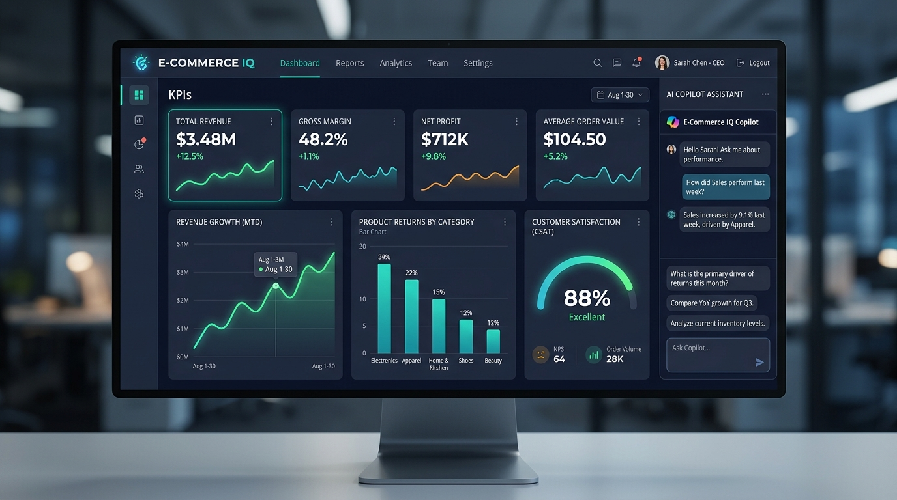

<div align="center">


# E-COMMERCE IQ

[](https://github.com/AlankritaPaul/E-Commerce-IQ)


<br/>

[](https://www.python.org/)
[-4479A1?style=for-the-badge&logo=sqlite&logoColor=white)](https://www.sqlite.org/)
[]()

<br/><br/>



<br/>
<em>Executive Business Intelligence & Decision Support Platform with Deterministic Analytics & Conversational AI Copilot</em>

</div>

---

**E-Commerce IQ** is an enterprise-grade, AI-powered Business Intelligence and Decision Support System built for e-commerce business owners, operators, and executives. 

Unlike conventional dashboards that only display static graphs, or generative AI chatbots prone to hallucinating numbers, E-Commerce IQ pairs a **deterministic SQL analytical calculation engine** with an **intelligent conversational AI copilot**. It allows business leaders to query their underlying business metrics using natural language and receive verified, data-backed financial figures paired with strategic diagnostic insights.

---

##  Core Languages & Concepts

-  **Python (3.10+)**: Powers backend analytics computation engines, statistical anomaly detection, natural language processing, LLM orchestration, Streamlit UI, and automated test suites.
-  **SQL (Relational SQL / SQLite / PostgreSQL Dialects)**: The deterministic foundation for all financial fact storage, data modeling, multi-table aggregations, time-series windowing, and safe Text-to-SQL generation.

---

##  Key Capabilities

###  1. Sales & Revenue Intelligence
- Real-time tracking of Gross Merchandise Value (GMV), Net Revenue, Total Orders, and Average Order Value (AOV).
- Profit margin analysis and discount erosion tracking.
- Breakdown of payment methods, shipping costs, and tax liabilities.

###  2. Product-Wise Performance
- Identification of high-margin bestsellers, cash cows, and lagging/dead inventory.
- Inventory turnover velocity and stockout risk monitoring.
- Unit economics per SKU and product category contribution margins.

###  3. Customer Behavior & Cohorts
- Customer retention, repeat purchase rates, and churn risk scoring.
- RFM (Recency, Frequency, Monetary) customer segmentation.
- Customer Lifetime Value (LTV) and regional sales distribution.

###  4. Customer Reviews & Sentiment Analysis
- Automated sentiment scoring (positive, neutral, negative) across written product feedback.
- Automated extraction of recurring complaints (e.g., sizing, zipper defects, late delivery) and top praises.
- Correlation between customer sentiment shifts and subsequent product sales trajectory.

###  5. Orders, Returns & Financial Leakage
- Comprehensive return rate calculation by product, category, and vendor.
- Categorization of return root causes (e.g., "Defective", "Not as Pictured", "Fit Issue").
- Tracking of net refund amounts and bottom-line margin loss due to returns.

###  6. Temporal Performance & Comparative Variance
- Automated Month-over-Month (MoM), Week-over-Week (WoW), and Year-over-Year (YoY) comparisons.
- Variance analysis highlighting percentage changes and absolute delta values.

###  7. Natural Language Conversational Copilot
- Business owners can ask questions in plain English, such as:
  - *"What was my net revenue this month compared to last month?"*
  - *"Which products have a return rate higher than 15%, and what are customers complaining about?"*
  - *"Why did sales drop in the Electronics category last week?"*
  - *"What is our current Average Order Value and repeat customer percentage?"*
- Converts queries into safe, read-only SQL, executes them deterministically, and provides executive summaries.

---

##  System Architecture

E-Commerce IQ is architected around a **Dual-Engine BI Pattern**:

```
                  +----------------------------------------------+
                  |           User Interface (Streamlit)         |
                  |     Executive KPI Cards | Visual Charts      |
                  |           Conversational AI Copilot          |
                  +----------------------+-----------------------+
                                         |
                                         v
                  +----------------------------------------------+
                  |              Query Router / Agent            |
                  +----------------------+-----------------------+
                                         |
                   +---------------------+---------------------+
                   |                                           |
                   v                                           v
    +------------------------------+            +------------------------------+
    |    Deterministic Analytics   |            |      AI / NLP Copilot        |
    |          (Python)            |            |        (LLM Engine)          |
    | - Revenue & AOV calculations |            | - Text-to-SQL generation     |
    | - MoM / WoW Variance         |            | - AST Guardrails (Read-Only) |
    | - Return & Defect ratios     |            | - Review Sentiment & Topics  |
    | - Exact numerical results    |            | - Executive Narrative Synthes|
    +--------------+---------------+            +--------------+---------------+
                   |                                           |
                   +---------------------+---------------------+
                                         |
                                         v
                  +----------------------------------------------+
                  |         Relational Database Layer            |
                  |    (SQLite / DuckDB / PostgreSQL via ORM)    |
                  | Orders, Items, Products, Customers, Reviews  |
                  +----------------------------------------------+
```

---

##  Where and How SQL is Used in E-Commerce IQ

SQL serves as the **single source of truth** and the deterministic engine across all analytical stages. Here is an overview of where SQL is implemented and how it operates:

###  1. Relational Data Modeling & Integrity (`src/ecommerce_iq/database/schema.sql`)
- **Normalized Schema**: 8 core relational tables (`customers`, `categories`, `products`, `orders`, `order_items`, `payments`, `returns`, `reviews`, `review_insights`, and `sales`).
- **Integrity Constraints**: Enforces foreign keys (`ON DELETE CASCADE`), `CHECK` constraints (valid CSAT ratings `1-5`, positive prices, non-negative quantities), and performance indexes on `order_date`, `customer_id`, `product_id`.
- **Analytical Views with CTEs**: Defines pre-aggregated analytical views (`v_product_performance`, `v_daily_sales_summary`) using Common Table Expressions (`WITH` clauses) to eliminate join fan-out.

###  2. High-Performance Native Query Gateway (`src/ecommerce_iq/database/connection.py`)
- **Direct Parameterized SQL**: `DatabaseManager.execute_query(sql, params)` runs raw SQL using Python's native `sqlite3` driver and `sqlite3.Row` dictionaries.
- **Connection Optimization**: Configures `PRAGMA foreign_keys = ON;` and thread-safe execution without ORM overhead.

###  3. Financial KPIs & Time-Series Aggregations (`src/ecommerce_iq/analytics/kpis.py`)
- **Exact Accounting Formulations**:
  ```sql
  SELECT 
      ROUND(SUM(oi.total_price), 2) AS gross_sales,
      ROUND(SUM(oi.total_price) - COALESCE(SUM(r.refund_amount), 0), 2) AS net_revenue,
      COUNT(DISTINCT o.order_id) AS total_orders,
      ROUND(SUM(oi.total_price) / COUNT(DISTINCT o.order_id), 2) AS aov
  FROM orders o
  JOIN order_items oi ON o.order_id = oi.order_id
  LEFT JOIN returns r ON o.order_id = r.order_id AND r.status = 'Approved';
  ```
- **Monthly Trajectory Windowing**: Uses `strftime('%Y-%m', o.order_date)` to aggregate trends over the 14 operating months.

###  4. SKU Unit Economics & Classification (`src/ecommerce_iq/analytics/products.py`)
- **Product Profitability & Margins**: Calculates profit margin per SKU using `ROUND((p.price - p.cost_price) * SUM(oi.quantity), 2)`.
- **Dead-Stock Inventory Detection**: Identifies slow-moving or unpurchased catalog items using `LEFT JOIN` and filtering for `NULL` order items.

###  5. Customer Behavior & RFM Quintiles (`src/ecommerce_iq/analytics/customers.py`)
- **Customer Lifetime Value (LTV)**: Aggregates total historical spend per customer account.
- **Order Frequency Distribution**: Uses SQL `CASE` statements to categorize customers into brackets (`1 Order`, `2-3 Orders`, `4-6 Orders`, `7-9 Orders`, `10+ Orders`).
- **Recency Calculation**: Computes days elapsed since last purchase via `CAST(julianday('now') - julianday(MAX(order_date)) AS INTEGER)`.

###  6. Returns & Refund Leakage Tracking (`src/ecommerce_iq/analytics/returns.py`)
- **Return Rate by SKU**: Computes returned unit percentage:
  ```sql
  ROUND((COALESCE(SUM(ret.quantity), 0) * 100.0 / SUM(oi.quantity)), 2) AS return_rate
  ```
- **RMA Reasons Breakdown**: Evaluates return incident counts and bottom-line dollar refund leakage grouped by stated customer reason.

###  7. Natural-Language Text-to-SQL Copilot (`src/ecommerce_iq/ai/text_to_sql.py`)
- **Schema-Grounded Query Translation**: Automatically maps plain-English executive questions into syntactically valid SQL queries targeting relevant entities and date ranges.

###  8. SQL Security Guardrails & AST Verification (`src/ecommerce_iq/ai/sql_guardrails.py`)
- **AST Token Inspection**: Analyzes queries with Abstract Syntax Tree parsers to strictly enforce read-only `SELECT` and `WITH` statements.
- **Mutation & Injection Blocking**: Instantly blocks destructive tokens (`DROP`, `DELETE`, `UPDATE`, `INSERT`, `ALTER`, `TRUNCATE`, `--`, `;`).
- **Table Whitelisting & Limit Clamping**: Verifies that queries only access authorized business tables and injects or clamps `LIMIT` clauses to guarantee bounded execution.

---

##  Technology Stack

-  **Core Programming Language**: Python 3.10+
-   **Data Manipulation & Math**: Pandas, NumPy
-   **Database & Query Engine**: SQLite / DuckDB (local analytical storage) / PostgreSQL (production), managed via SQLAlchemy ORM
-  **SQL Security & Parsing**: SQLGlot (AST parsing, read-only enforcement, injection protection)
-  **AI & Large Language Models**: Google Gemini API (`google-genai`), with pluggable support for OpenAI (`openai`)
-  **Natural Language & Sentiment**: VADER Sentiment, TextBlob
-   **User Interface & Visualization**: Streamlit, Plotly
-  **Data Generation & Quality**: Faker, Pytest (117 automated unit & integration tests)
-  **Version Control & CI/CD**: Git, GitHub

---

##  Directory Layout

```
E-Commerce-IQ/
├── .env.example                  # Environment configuration template
├── .gitignore                    # Git tracking rules
├── pyproject.toml                # Project packaging & build specifications
├── requirements.txt              # Pinned dependencies
├── README.md                     # Project documentation
│
├── config/                       # Application configuration
│   ├── __init__.py
│   └── settings.py               # Pydantic BaseSettings management
│
├── docs/                         # Technical architecture & schema docs
│   ├── architecture.md           # System architecture specification
│   ├── database_schema.md        # Relational schema reference
│   └── images/                   # Dashboard preview, animated SVG, and topic icons
│
├── src/ecommerce_iq/             # Core application package
│   ├── __init__.py
│   ├── database/                 # Connection pools, sessions, and engine setup
│   │   ├── __init__.py
│   │   ├── connection.py
│   │   └── schema.sql
│   ├── models/                   # ORM entities and Pydantic validation schemas
│   │   ├── __init__.py
│   │   ├── entities.py
│   │   └── schemas.py
│   ├── analytics/                # Deterministic analytical computation engines
│   │   ├── __init__.py
│   │   ├── kpis.py
│   │   ├── comparisons.py
│   │   ├── products.py
│   │   └── returns.py
│   ├── business_logic/           # Domain workflows & strategic decision services
│   │   ├── __init__.py
│   │   ├── diagnosis.py
│   │   ├── segmentation.py
│   │   └── recommendations.py
│   ├── ai/                       # AI, Text-to-SQL, and NLP sentiment pipelines
│   │   ├── __init__.py
│   │   ├── llm_client.py
│   │   ├── text_to_sql.py
│   │   ├── sql_guardrails.py
│   │   ├── sentiment.py
│   │   └── advisor.py
│   └── utils/                    # Shared utilities
│       ├── __init__.py
│       ├── formatting.py
│       └── logging.py
│
├── ui/                           # Interactive Streamlit presentation layer
│   ├── __init__.py
│   ├── app.py                    # Main dashboard application entrypoint
│   ├── components/               # Modular UI widgets (cards, charts, copilot)
│   │   ├── __init__.py
│   │   ├── cards.py
│   │   ├── charts.py
│   │   └── chat.py
│   ├── views/                    # Internal analytical view implementations
│   └── pages/                    # 11 Sequentially-ordered stage views
│       ├── 01_Sales_and_Revenue.py
│       ├── 02_Product_Performance.py
│       ├── 03_Customer_Behavior.py
│       ├── 04_Customer_Reviews.py
│       ├── 05_Returns_and_Refunds.py
│       ├── 06_Root_Cause_Diagnosis.py
│       ├── 07_Strategic_Playbook.py
│       ├── 08_Conversational_Copilot.py
│       ├── 09_Natural_Language_Query.py
│       ├── 10_Executive_Summary.py
│       └── 11_Data_Management.py
│
├── tests/                        # Automated unit and integration test suite
│   ├── __init__.py
│   ├── conftest.py
│   ├── test_config.py
│   ├── test_models.py
│   ├── test_analytics.py
│   └── test_ai.py
│
└── data/                         # Local database and dataset storage
    └── .gitkeep
```

---

##  Getting Started

###  1. Prerequisites
- Python 3.10 or higher
- Git

###  2. Environment Setup
```bash
# Clone repository
git clone https://github.com/AlankritaPaul/E-Commerce-IQ.git
cd E-Commerce-IQ

# Create a virtual environment
python -m venv .venv

# Activate virtual environment
# On Windows:
.venv\Scripts\activate
# On Linux/macOS:
source .venv/bin/activate

# Install dependencies
pip install -r requirements.txt
```

###  3. Environment Configuration
Copy the sample environment file:
```bash
cp .env.example .env
```
Open `.env` and set your configuration variables (e.g., `GEMINI_API_KEY`).

###  4. Running the Project
```bash
# Initialize the database schema
python scripts/init_db.py

# Seed the 14-month realistic dataset
python scripts/seed_mock_data.py

# Run all 117 automated unit and integration tests
python -m unittest discover -s tests

# Launch the interactive BI Dashboard
python -m streamlit run ui/app.py
```

---

##  License

This project is licensed under the [MIT License](LICENSE).
