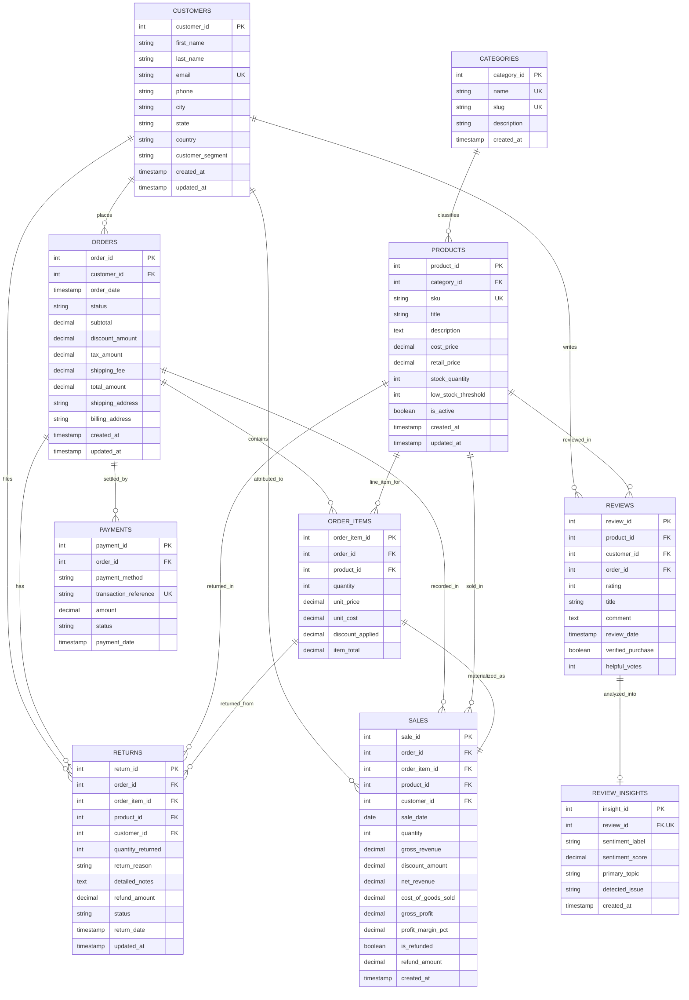

# E-Commerce IQ: Production Relational Database Schema

## 1. Schema Overview & Architecture

The database architecture is designed for **high-throughput real-world business analytics** rather than a trivial demo schema. It balances 3rd Normal Form (3NF) relational integrity with optimized analytical read performance.

### Architectural Highlights:
- **Foreign Key Constraints (`PRAGMA foreign_keys = ON;`)**: Guarantees referential integrity across the entire data model.
- **Historical Unit Cost Preservation**: `order_items` stores a snapshot of `unit_cost` at time of purchase, preventing historical margin distortion if product manufacturing costs change.
- **Dedicated Analytical Sales Ledger (`sales`)**: Eliminates expensive 5-table JOIN queries during high-frequency executive question answering and MoM/WoW variance calculations.
- **Multi-Level Indexing**: Composite and single-column indexes on all foreign keys, dates, and categorical status columns for O(log N) filtered aggregations.
- **Defect & Return Taxonomy**: Categorized root causes (`Defective/Damaged`, `Incorrect Size/Fit`, `Item Not as Pictured`, `Customer Changed Mind`, etc.) tied directly to line items and customer IDs.
- **Pre-computed Review Insights**: Direct support for AI/NLP sentiment polarity and extracted complaint topics.

---

## 2. Entity-Relationship Diagram (ERD)



---

## 3. Detailed Table Specifications

### 3.1 `categories`
| Column | Type | Constraints | Description |
| :--- | :--- | :--- | :--- |
| `category_id` | `INTEGER` | `PRIMARY KEY AUTOINCREMENT` | Unique category identifier |
| `name` | `VARCHAR(100)` | `NOT NULL UNIQUE` | Category display title |
| `slug` | `VARCHAR(120)` | `NOT NULL UNIQUE` | URL/lookup identifier |
| `description` | `TEXT` | `NULL` | Detailed category scope |
| `created_at` | `TIMESTAMP` | `DEFAULT CURRENT_TIMESTAMP` | Category creation timestamp |

### 3.2 `customers`
| Column | Type | Constraints | Description |
| :--- | :--- | :--- | :--- |
| `customer_id` | `INTEGER` | `PRIMARY KEY AUTOINCREMENT` | Unique customer account ID |
| `first_name` | `VARCHAR(100)` | `NOT NULL` | Customer first name |
| `last_name` | `VARCHAR(100)` | `NOT NULL` | Customer surname |
| `email` | `VARCHAR(255)` | `NOT NULL UNIQUE` | Primary contact & login email |
| `phone` | `VARCHAR(30)` | `NULL` | Contact phone number |
| `street_address`| `VARCHAR(255)` | `NULL` | Primary shipping street |
| `city` | `VARCHAR(100)` | `NOT NULL` | City of residence |
| `state` | `VARCHAR(100)` | `NULL` | State / Province |
| `postal_code` | `VARCHAR(20)` | `NULL` | Postal / ZIP code |
| `country` | `VARCHAR(100)` | `DEFAULT 'USA'` | Country |
| `customer_segment`| `VARCHAR(50)` | `CHECK IN ('New', 'Regular', 'VIP High Value', 'At-Risk', 'Churned')` | Automated behavioral cohort |
| `created_at` | `TIMESTAMP` | `DEFAULT CURRENT_TIMESTAMP` | Registration date |
| `updated_at` | `TIMESTAMP` | `DEFAULT CURRENT_TIMESTAMP` | Last profile update |

### 3.3 `products`
| Column | Type | Constraints | Description |
| :--- | :--- | :--- | :--- |
| `product_id` | `INTEGER` | `PRIMARY KEY AUTOINCREMENT` | Catalog item unique ID |
| `category_id` | `INTEGER` | `FK -> categories.category_id ON DELETE RESTRICT` | Category mapping |
| `sku` | `VARCHAR(60)` | `NOT NULL UNIQUE` | Stock Keeping Unit |
| `title` | `VARCHAR(255)` | `NOT NULL` | Product name |
| `description` | `TEXT` | `NULL` | Product specs & description |
| `cost_price` | `DECIMAL(10,2)`| `CHECK (cost_price >= 0)` | Supplier cost per unit |
| `retail_price` | `DECIMAL(10,2)`| `CHECK (retail_price >= 0)` | Retail selling price |
| `stock_quantity`| `INTEGER` | `CHECK (stock_quantity >= 0)` | On-hand warehouse inventory |
| `low_stock_threshold`| `INTEGER` | `DEFAULT 10` | Re-order trigger threshold |
| `is_active` | `BOOLEAN` | `DEFAULT 1` | Catalog visibility flag |
| `created_at` | `TIMESTAMP` | `DEFAULT CURRENT_TIMESTAMP` | Creation timestamp |
| `updated_at` | `TIMESTAMP` | `DEFAULT CURRENT_TIMESTAMP` | Last catalog update |

### 3.4 `orders`
| Column | Type | Constraints | Description |
| :--- | :--- | :--- | :--- |
| `order_id` | `INTEGER` | `PRIMARY KEY AUTOINCREMENT` | Unique order transaction ID |
| `customer_id` | `INTEGER` | `FK -> customers.customer_id ON DELETE RESTRICT` | Purchasing customer |
| `order_date` | `TIMESTAMP` | `DEFAULT CURRENT_TIMESTAMP` | Exact order checkout timestamp |
| `status` | `VARCHAR(50)` | `CHECK IN ('pending', 'processing', 'completed', 'shipped', 'cancelled', 'refunded')` | Order lifecycle status |
| `subtotal` | `DECIMAL(10,2)`| `CHECK (subtotal >= 0)` | Pre-discount, pre-tax goods total |
| `discount_amount`| `DECIMAL(10,2)`| `DEFAULT 0.00` | Coupon & promotional discount |
| `tax_amount` | `DECIMAL(10,2)`| `DEFAULT 0.00` | Sales tax collected |
| `shipping_fee` | `DECIMAL(10,2)`| `DEFAULT 0.00` | Shipping fees charged |
| `total_amount` | `DECIMAL(10,2)`| `CHECK (total_amount >= 0)` | Final net settlement amount |
| `shipping_address`| `VARCHAR(255)`| `NULL` | Delivery destination |
| `billing_address` | `VARCHAR(255)`| `NULL` | Payment billing address |

### 3.5 `order_items`
| Column | Type | Constraints | Description |
| :--- | :--- | :--- | :--- |
| `order_item_id` | `INTEGER` | `PRIMARY KEY AUTOINCREMENT` | Individual purchase line item |
| `order_id` | `INTEGER` | `FK -> orders.order_id ON DELETE CASCADE` | Associated order header |
| `product_id` | `INTEGER` | `FK -> products.product_id ON DELETE RESTRICT` | Purchased product SKU |
| `quantity` | `INTEGER` | `CHECK (quantity > 0)` | Units purchased |
| `unit_price` | `DECIMAL(10,2)`| `CHECK (unit_price >= 0)` | Price per unit at purchase time |
| `unit_cost` | `DECIMAL(10,2)`| `CHECK (unit_cost >= 0)` | COGS snapshot at purchase time |
| `discount_applied`| `DECIMAL(10,2)`| `DEFAULT 0.00` | Item-specific discount |
| `item_total` | `DECIMAL(10,2)`| `CHECK (item_total >= 0)` | Net line item total |

### 3.6 `payments`
| Column | Type | Constraints | Description |
| :--- | :--- | :--- | :--- |
| `payment_id` | `INTEGER` | `PRIMARY KEY AUTOINCREMENT` | Payment record identifier |
| `order_id` | `INTEGER` | `FK -> orders.order_id ON DELETE CASCADE` | Associated order |
| `payment_method`| `VARCHAR(50)` | `CHECK IN ('credit_card', 'debit_card', 'paypal', 'apple_pay', 'google_pay', 'bank_transfer', 'store_credit')` | Payment gateway used |
| `transaction_reference` | `VARCHAR(100)` | `UNIQUE NOT NULL` | Gateway transaction/charge ID |
| `amount` | `DECIMAL(10,2)`| `CHECK (amount >= 0)` | Settled financial value |
| `status` | `VARCHAR(50)` | `CHECK IN ('pending', 'completed', 'failed', 'refunded')` | Settlement state |
| `payment_date` | `TIMESTAMP` | `DEFAULT CURRENT_TIMESTAMP` | Gateway charge timestamp |

### 3.7 `returns`
| Column | Type | Constraints | Description |
| :--- | :--- | :--- | :--- |
| `return_id` | `INTEGER` | `PRIMARY KEY AUTOINCREMENT` | Unique return claim ID |
| `order_id` | `INTEGER` | `FK -> orders.order_id ON DELETE CASCADE` | Originating order |
| `order_item_id`| `INTEGER` | `FK -> order_items.order_item_id ON DELETE CASCADE` | Returned line item |
| `product_id` | `INTEGER` | `FK -> products.product_id ON DELETE RESTRICT` | Returned product |
| `customer_id` | `INTEGER` | `FK -> customers.customer_id ON DELETE RESTRICT` | Returning customer |
| `quantity_returned` | `INTEGER` | `CHECK (quantity_returned > 0)` | Units returned |
| `return_reason`| `VARCHAR(100)`| `CHECK IN ('Defective/Damaged', 'Incorrect Size/Fit', 'Item Not as Pictured', 'Customer Changed Mind', 'Arrived Too Late', 'Wrong Item Shipped', 'Other')` | Customer complaint root cause |
| `detailed_notes`| `TEXT` | `NULL` | Customer or agent feedback |
| `refund_amount`| `DECIMAL(10,2)`| `CHECK (refund_amount >= 0)` | Financial refund value issued |
| `status` | `VARCHAR(50)` | `CHECK IN ('requested', 'approved', 'rejected', 'completed')` | Return RMA lifecycle status |
| `return_date` | `TIMESTAMP` | `DEFAULT CURRENT_TIMESTAMP` | Return creation timestamp |

### 3.8 `reviews`
| Column | Type | Constraints | Description |
| :--- | :--- | :--- | :--- |
| `review_id` | `INTEGER` | `PRIMARY KEY AUTOINCREMENT` | Review record identifier |
| `product_id` | `INTEGER` | `FK -> products.product_id ON DELETE CASCADE` | Reviewed product |
| `customer_id` | `INTEGER` | `FK -> customers.customer_id ON DELETE RESTRICT` | Reviewer |
| `order_id` | `INTEGER` | `FK -> orders.order_id ON DELETE SET NULL` | Verified order (optional) |
| `rating` | `INTEGER` | `CHECK (rating >= 1 AND rating <= 5)` | 1 to 5 star rating |
| `title` | `VARCHAR(255)`| `NULL` | Review headline |
| `comment` | `TEXT` | `NOT NULL` | Full textual customer review |
| `review_date` | `TIMESTAMP` | `DEFAULT CURRENT_TIMESTAMP` | Submission timestamp |
| `verified_purchase`| `BOOLEAN` | `DEFAULT 1` | Verified order badge |
| `helpful_votes`| `INTEGER` | `DEFAULT 0` | Customer upvotes |

### 3.9 `review_insights`
| Column | Type | Constraints | Description |
| :--- | :--- | :--- | :--- |
| `insight_id` | `INTEGER` | `PRIMARY KEY AUTOINCREMENT` | Insight identifier |
| `review_id` | `INTEGER` | `FK -> reviews.review_id ON DELETE CASCADE, UNIQUE` | 1-to-1 link to Review |
| `sentiment_label`| `VARCHAR(20)` | `CHECK IN ('positive', 'neutral', 'negative')` | Classified polarity |
| `sentiment_score`| `DECIMAL(5,4)`| `CHECK (sentiment_score BETWEEN -1.0 AND 1.0)` | Continuous polarity (-1 to +1) |
| `primary_topic`| `VARCHAR(100)`| `NULL` | Extracted topic (e.g. Sizing, Quality) |
| `detected_issue`| `VARCHAR(255)`| `NULL` | Extracted root defect if negative |

### 3.10 `sales` (Consolidated Performance & Margin Fact Table)
| Column | Type | Constraints | Description |
| :--- | :--- | :--- | :--- |
| `sale_id` | `INTEGER` | `PRIMARY KEY AUTOINCREMENT` | Fact record identifier |
| `order_id` | `INTEGER` | `FK -> orders.order_id ON DELETE CASCADE` | Associated order |
| `order_item_id`| `INTEGER` | `FK -> order_items.order_item_id ON DELETE CASCADE` | Associated line item |
| `product_id` | `INTEGER` | `FK -> products.product_id ON DELETE RESTRICT` | Sold product |
| `customer_id` | `INTEGER` | `FK -> customers.customer_id ON DELETE RESTRICT` | Purchasing customer |
| `sale_date` | `DATE` | `NOT NULL` | Calendar date of transaction |
| `quantity` | `INTEGER` | `CHECK (quantity > 0)` | Quantity sold |
| `gross_revenue`| `DECIMAL(10,2)`| `CHECK (gross_revenue >= 0)` | Pre-discount item revenue |
| `discount_amount`| `DECIMAL(10,2)`| `DEFAULT 0.00` | Discount applied to line |
| `net_revenue` | `DECIMAL(10,2)`| `CHECK (net_revenue >= 0)` | Net revenue earned |
| `cost_of_goods_sold`| `DECIMAL(10,2)`| `CHECK (cost_of_goods_sold >= 0)`| Total cost to acquire/make goods |
| `gross_profit` | `DECIMAL(10,2)`| `NOT NULL` | `net_revenue - cost_of_goods_sold` |
| `profit_margin_pct`| `DECIMAL(6,2)` | `NOT NULL` | `(gross_profit / net_revenue) * 100` |
| `is_refunded` | `BOOLEAN` | `DEFAULT 0` | Flagged true if item was refunded |
| `refund_amount`| `DECIMAL(10,2)`| `DEFAULT 0.00` | Refund issued on this line |

---

## 4. Analytical Views

### 4.1 `v_product_performance_summary`
Pre-aggregates total units sold, gross revenue, units returned, return rate percentage, average star rating, and review count grouped by product.
```sql
SELECT * FROM v_product_performance_summary WHERE return_rate_percentage > 10.0;
```

### 4.2 `v_daily_business_summary`
Rolls up daily order volumes, gross revenue, net revenue, discounts, average order value (AOV), and refunds issued for instant MoM and WoW time-series graphs.
```sql
SELECT * FROM v_daily_business_summary ORDER BY summary_date DESC LIMIT 30;
```

---

## 5. Performance Indexes

1. **Foreign Key Indexes**:
   - `idx_orders_customer_id`, `idx_order_items_order_id`, `idx_order_items_product_id`
   - `idx_payments_order_id`, `idx_returns_order_id`, `idx_returns_product_id`, `idx_reviews_product_id`
2. **Temporal & Range Indexes**:
   - `idx_orders_order_date`, `idx_sales_sale_date`, `idx_returns_date`, `idx_reviews_date`
3. **Composite Filtering Indexes**:
   - `idx_orders_customer_date`: `(customer_id, order_date)` for customer purchase frequency and RFM.
   - `idx_sales_date_product`: `(sale_date, product_id)` for time-series product velocity.
   - `idx_sales_date_revenue`: `(sale_date, net_revenue)` for daily financial rollups.
   - `idx_returns_product_reason`: `(product_id, return_reason)` for defect diagnosis.
   - `idx_reviews_product_rating`: `(product_id, rating)` for CSAT score distributions.
